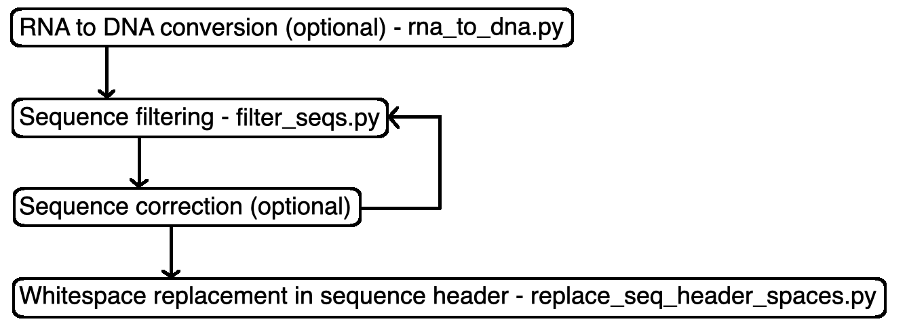

# Biological sequence pre-processing workflow

The workflow depicted above is recommended to pre-process input biological (DNA/RNA/protein) sequences so that they can be clustered with ALFATClust. It consists of two core stages:

1. `Sequence filtering`: To identify sequences that will be rejected during clustering
2. `Whitespace replacement in sequence`: To replace all whitespaces in the FASTA sequence header by underscore (_) characters.

Based on the given reason(s) associated to each filtered (rejected) sequences, users may manually revise them and run the sequence filtering stage again. However, users may also opt to skip the filtered sequences for clustering (unfiltered sequences are exported to a new FASTA file). The subsequent whitespace replacement stage eliminates problematic whitespaces in the FASTA sequence headers.

Before running the above two core stages, an optional stage can be utilized to convert RNA sequences into DNA sequences so that they can also be clustered using ALFATClust.

## Utilities supporting the sequence pre-processing workflow

### **A. Sequence filtering**

Filter problematic DNA/protein sequences that cannot be clustered properly

**Command**

./filter_seqs.py [optional arguments] -i *\<sequence file path>* -o *\<output sequence file path>* 

**Mandatory arguments**

| Argument name                                | Description                                                     |
| -------------------------------------------- | --------------------------------------------------------------- |
| `-i/--input` *\<sequence file path>*         | (full/relative) input DNA/protein sequence FASTA file path      |
| `-o/--output` *\<output sequence file path>* | (full/relative) output FASTA file path for unfiltered sequences |

**Optional arguments**

| Argument name                            | Description [default value]                                                                                           |
| ---------------------------------------- | --------------------------------------------------------------------------------------------------------------------- |
| `-e/--error` *\<error report file path>* | export filtered sequence headers and the associated inspection results to (full/relative) *\<error report file path>* |
| `-b/--target` *\[aa/dna/auto]*           | specify input sequences as protein (aa) / DNA (dna) sequences, or let the tool to detemine (auto) [auto]              |
| `-k/--kmer` *\<kmer>*                    | set the Mash kmer size requirement to *\<kmer>* [DNA: 17; protein: 9]                                                 |
| `-h/--help`                              | show help message and exit                                                                                            |

### **B. Sequence header whitespace replacement**

Replace all whitespaces in FASTA sequence headers by underscore characters

**Command**

./replace_seq_header_spaces.py [optional arguments] -i *\<sequence file path>* -o *\<output sequence file path>* 

**Mandatory arguments**

| Argument name                                | Description                                                 |
| -------------------------------------------- | ----------------------------------------------------------- |
| `-i/--input` *\<sequence file path>*         | (full/relative) input DNA/protein sequence FASTA file path  |
| `-o/--output` *\<output sequence file path>* | (full/relative) output DNA/protein sequence FASTA file path |

**Optional arguments**

| Argument name | Description                |
| ------------- | -------------------------- |
| `-h/--help`   | show help message and exit |

### **C. RNA to DNA conversion**

Convert RNA sequences to DNA sequences through reverse transcription

**Command**

./rna_to_dna.py [optional arguments] -i *\<RNA sequence file path>* -o *\<DNA sequence file path>*

**Mandatory arguments**

| Argument name                             | Description                                         |
| ----------------------------------------- | --------------------------------------------------- |
| `-i/--input` *\<RNA sequence file path>*  | (full/relative) input RNA sequence FASTA file path  |
| `-o/--output` *\<DNA sequence file path>* | (full/relative) output DNA sequence FASTA file path |

**Optional arguments**

| Argument name   | Description                                            |
| --------------- | ------------------------------------------------------ |
| `-r/--reverse`  | Perform reverse complement after reverse transcription |
| `-h/--help`     | show help message and exit                             |
